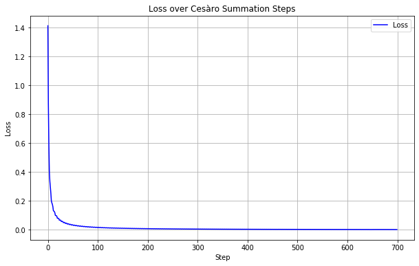

# Task 2: Analysis of an ergodic Markov chain. Calculation of the steady-state vector of Markov chain by Cesàro summation

Prepare my personal Markov chain probability transition matrix $P$: 

```
[[0.00000 0.00000 0.12819 0.36008 0.00000 0.00000 0.00000 0.00000 0.15395 0.00000 0.35778 0.00000]
 [0.34321 0.00000 0.00000 0.00000 0.00000 0.65679 0.00000 0.00000 0.00000 0.00000 0.00000 0.00000]
 [0.00000 0.00000 0.00000 0.00000 0.00000 0.00000 0.35969 0.45478 0.00000 0.00000 0.00000 0.18553]
 [0.00000 0.00000 0.00000 0.00000 0.00000 0.00000 0.53366 0.46174 0.00000 0.00000 0.00000 0.00459]
 [0.35442 0.00000 0.00000 0.00000 0.00000 0.64558 0.00000 0.00000 0.00000 0.00000 0.00000 0.00000]
 [0.00000 0.00000 0.55971 0.05475 0.00000 0.00000 0.00000 0.00000 0.20515 0.00000 0.18039 0.00000]
 [0.00000 0.29669 0.00000 0.00000 0.49574 0.00000 0.00000 0.00000 0.00000 0.20757 0.00000 0.00000]
 [0.00000 0.60745 0.00000 0.00000 0.36487 0.00000 0.00000 0.00000 0.00000 0.02768 0.00000 0.00000]
 [0.00000 0.00000 0.00000 0.00000 0.00000 0.00000 0.31611 0.20304 0.00000 0.00000 0.00000 0.48085]
 [0.39972 0.00000 0.00000 0.00000 0.00000 0.60028 0.00000 0.00000 0.00000 0.00000 0.00000 0.00000]
 [0.00000 0.00000 0.00000 0.00000 0.00000 0.00000 0.00130 0.52081 0.00000 0.00000 0.00000 0.47790]
 [0.00000 0.12827 0.00000 0.00000 0.52640 0.00000 0.00000 0.00000 0.00000 0.34533 0.00000 0.00000]]
```

## Solution

Find cyclic classes in which the chain is divided：

For finding the chain period d and cyclic classes we begin moving from any state of the chain.

Let the state 3 is starting. From the state 7, 8, 12 can be reached; from the states 7, 8, 12, states [2, 5, 10] are reachable. This moving can be listed in the following:
- step.1 -> 3
- step.2 -> 7, 8, 12
- step.3 -> 2, 5, 10
- step.4 -> 1, 6
- step.5 -> 3, 4, 9, 11
- step.6 -> 7, 8, 12
- step.7 -> 2, 5, 10
- step.9 -> 1, 6
- step.10 -> .....

It is obvious that $d$=4 and cyclic classes are $d$=4 and cyclic classes are $C_0=${$7, 8, 12$}, $C_1=${$2, 5, 10$}, $C_2=${$1, 6$}, $C_3=${$3, 4, 9, 11$}

Transitions between classes: $C_0$ -> $C_1$ -> $C_2$ -> $C_3$ -> $C_0$ -> $C_1$ -> ...  

The limiting matrix $A$ can be found as the limit $A(t) = \frac{1}{t} \sum_{i=0}^{t-1} P^i $ when $ t \rightarrow \infty $ (summation by Cesàro). The number $ t $ should be enough large.

The limiting matrix A for t = 700:

```
[[0.09038 0.09531 0.10093 0.04128 0.11219 0.15962 0.07316 0.10627 0.04666 0.04250 0.06113 0.07056]
 [0.08944 0.09619 0.10133 0.04100 0.11155 0.16056 0.07317 0.10625 0.04671 0.04226 0.06096 0.07058]
 [0.08946 0.09534 0.10217 0.04077 0.11218 0.16054 0.07327 0.10629 0.04644 0.04248 0.06062 0.07044]
 [0.08946 0.09539 0.10075 0.04220 0.11218 0.16054 0.07351 0.10630 0.04644 0.04244 0.06062 0.07018]
 [0.08946 0.09476 0.10133 0.04100 0.11298 0.16054 0.07317 0.10625 0.04671 0.04226 0.06097 0.07058]
 [0.08895 0.09530 0.10154 0.04085 0.11220 0.16105 0.07317 0.10623 0.04673 0.04251 0.06088 0.07059]
 [0.08947 0.09518 0.10132 0.04100 0.11226 0.16053 0.07418 0.10564 0.04671 0.04256 0.06097 0.07018]
 [0.08945 0.09563 0.10133 0.04100 0.11207 0.16055 0.07275 0.10707 0.04671 0.04230 0.06097 0.07018]
 [0.08947 0.09516 0.10074 0.04077 0.11224 0.16053 0.07320 0.10593 0.04787 0.04260 0.06062 0.07087]
 [0.08952 0.09476 0.10130 0.04102 0.11155 0.16048 0.07317 0.10625 0.04670 0.04369 0.06098 0.07058]
 [0.08946 0.09530 0.10074 0.04077 0.11218 0.16054 0.07275 0.10639 0.04644 0.04252 0.06205 0.07086]
 [0.08948 0.09494 0.10132 0.04101 0.11231 0.16052 0.07275 0.10564 0.04671 0.04275 0.06097 0.07161]]
```

The rows of the matrix A are approximately equal, but not identical.

The L2 error between each row is given by 0.002298541379180601.



