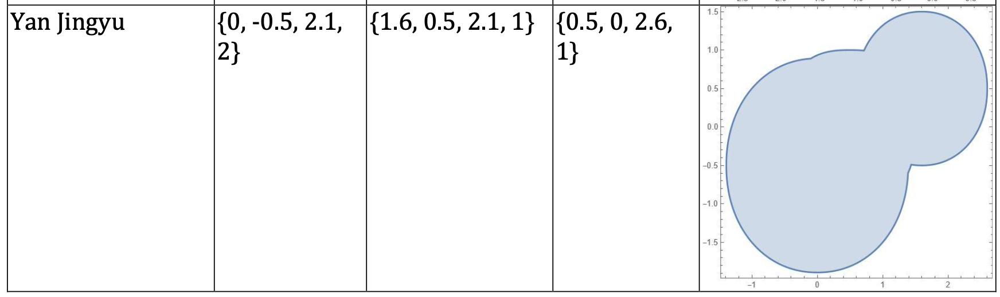

# Task 3 : Calculation of square of a domain by Monter Carlo method

## Show my data From Worksheet3

Equation of domains' boundaries:
$$D_1 : |x|^{2.1} + |y + 0.5|^{2.1} = 2$$

$$D_2 : |x - 1.6|^{2.1} + |y - 0.5|^{2.1} = 1.0$$

$$D_3 : |x - 0.5|^{2.6} + |y|^{2.6} = 1$$

    

    
Domain D—the union of domains D1, D2, D3

## Solution

We can find $R$, $R =[-1.3910656192458295, 2.6] \times [-1.8910656192458295, 1.5]$, square $S=13.533965405578599$

After calculation, the following conclusions are drawn:

Accuracy of the square $S_0$ for different sample size (confidence probability 90%)

| N    | $S_0$          | accuracy of $p(\epsilon)$         | abs.accuracy of $S_0$ | rel.accuracy of $S_0$ |
|------|-------------|-----------|--------------------|--------------------|
| 10   | 10.82717232 | 0.08348413| 1.129871330       | 10.4355%           |
| 25   | 10.28581371 | 0.060192  | 0.814636446       | 7.92%              |
| 60   | 8.797077514 | 0.04846070| 0.655865493       | 7.4555%            |
| 150  | 8.481284987 | 0.03151895| 0.426576316       | 5.0296%            |
| 400  | 8.221883984 | 0.01967161| 0.266234881       | 3.2381%            |
| 1000 | 8.810611479 | 0.01185469| 0.160441023       | 1.821%   |

The relative accuracy of the square $S_0$ equals $1.821\% $, so this value enough for the task.As the absolute accuracy for $N=1000$, and confidence probability $90\%$ equals $0.160441023	$, true value of the $S_0$ belongs to
    
$$ (8.810611479 - 0.160441023, 8.810611479 + 0.160441023) = (8.65017, 8.97105) $$
    
with probability $0.90$. $S_0 < 8.65017$ or $S_0 > 8.97105$  with probability $1 - 0.90 = 0.1$.

The dependence of the relative accuracy of the square $S_0$ on sample size is shown in Figure below

    

    
The relative accuracy of the square $S_0$ as a function of sample size $N$.
